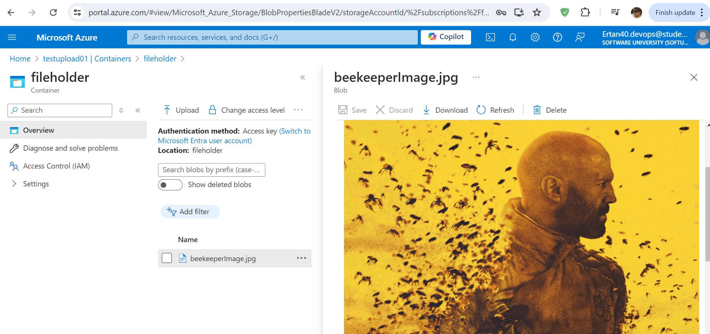

# Azure Blob Storage Management Script

This repository contains a Python script that interacts with Azure Blob Storage to perform basic operations such as creating a container, uploading files, and deleting blobs and containers. The script utilizes the Azure SDK for Python to perform these operations.
<p></p>

## Prerequisites

Before running the script, ensure you have the following:

1. **Azure Account**: An active Azure subscription.
2. **Azure Storage Account**: A storage account in Azure where you will upload and manage files.
3. **Python 3.x**: Installed on your local machine.
4. **Azure SDK for Python**: Install the required packages by running:
   ```bash
   pip install azure-storage-blob
   ```

## Environment Variables

The script uses environment variables to securely manage sensitive information like the storage account name, key, and connection string. The environment variables are:

- `AZURE_STORAGE_ACCOUNT_NAME`: The name of your Azure storage account.
- `AZURE_STORAGE_ACCOUNT_KEY`: The key associated with your Azure storage account.
- `AZURE_STORAGE_CONNECTION_STRING`: The connection string for your Azure storage account.

If these variables are not set, the script falls back to the hardcoded values in the script.

## Script Overview

### Import Statements

- **`from azure.storage.blob import BlobServiceClient`**: The `BlobServiceClient` class is the primary interface to interact with Azure Blob Storage, enabling operations like creating containers, uploading blobs, and deleting resources.
- **`from azure.core.exceptions import ResourceExistsError, ResourceNotFoundError`**: These exceptions are used to handle specific error cases when working with Azure resources, such as when a container or blob already exists or is not found.

### Methods

#### 1. `create_container(container_name)`

- **Purpose**: Creates a new container in Azure Blob Storage if it doesn't already exist.
- **Parameters**:
  - `container_name`: The name of the container to be created.
- **Used Methods**:
  - `BlobServiceClient.from_connection_string(connection_string)`: Initializes the `BlobServiceClient` using the connection string.
  - `create_container(container_name)`: Creates the container in the Blob Storage.
- **Error Handling**:
  - `ResourceExistsError`: Caught if the container already exists.
  - Generic Exception: Catches and prints any other errors that occur during container creation.

#### 2. `upload_file_to_blob(file_path, file_name, container_name)`

- **Purpose**: Uploads a file from the local system to a specified container in Azure Blob Storage.
- **Parameters**:
  - `file_path`: The local file path of the file to be uploaded.
  - `file_name`: The name under which the file will be stored in the blob.
  - `container_name`: The name of the container where the file will be uploaded.
- **Used Methods**:
  - `get_blob_client(container=container_name, blob=file_name)`: Retrieves a `BlobClient` to interact with a specific blob in a container.
  - `upload_blob(data)`: Uploads the file data to the blob.
- **Error Handling**:
  - `FileNotFoundError`: Caught if the specified file path does not exist.
  - `ResourceNotFoundError`: Caught if the specified container does not exist.
  - Generic Exception: Catches and prints any other errors that occur during the file upload.

#### 3. `delete_blob(container_name, blob_name)`

- **Purpose**: Deletes a specific blob from a container in Azure Blob Storage.
- **Parameters**:
  - `container_name`: The name of the container where the blob is stored.
  - `blob_name`: The name of the blob to be deleted.
- **Used Methods**:
  - `get_blob_client(container=container_name, blob=blob_name)`: Retrieves a `BlobClient` to interact with a specific blob in a container.
  - `delete_blob()`: Deletes the blob from the container.
- **Error Handling**:
  - `ResourceNotFoundError`: Caught if the specified blob or container does not exist.
  - Generic Exception: Catches and prints any other errors that occur during the blob deletion.

#### 4. `delete_container(container_name)`

- **Purpose**: Deletes a specified container and all the blobs within it from Azure Blob Storage.
- **Parameters**:
  - `container_name`: The name of the container to be deleted.
- **Used Methods**:
  - `get_container_client(container_name)`: Retrieves a `ContainerClient` to interact with a specific container.
  - `delete_container()`: Deletes the container and all its blobs.
- **Error Handling**:
  - `ResourceNotFoundError`: Caught if the specified container does not exist.
  - Generic Exception: Catches and prints any other errors that occur during the container deletion.

## Usage

1. **Create a Container**:
   ```python
   create_container('fileholder')
   ```

2. **Upload a File to Blob**:
   ```python
   upload_file_to_blob('C:\\Users\\ertan\\Downloads\\beekeeper.jpg', 'beekeeperImage.jpg', 'fileholder')
   ```

3. **Delete a Blob**:
   ```python
   delete_blob('fileholder', 'beekeeperImage.jpg')
   ```

4. **Delete a Container**:
   ```python
   delete_container('fileholder')
   ```

## Conclusion

This script provides a straightforward way to manage Azure Blob Storage containers and blobs using Python. By following best practices like environment variables for sensitive data and handling exceptions appropriately, the script ensures safe and reliable interactions with Azure resources.
